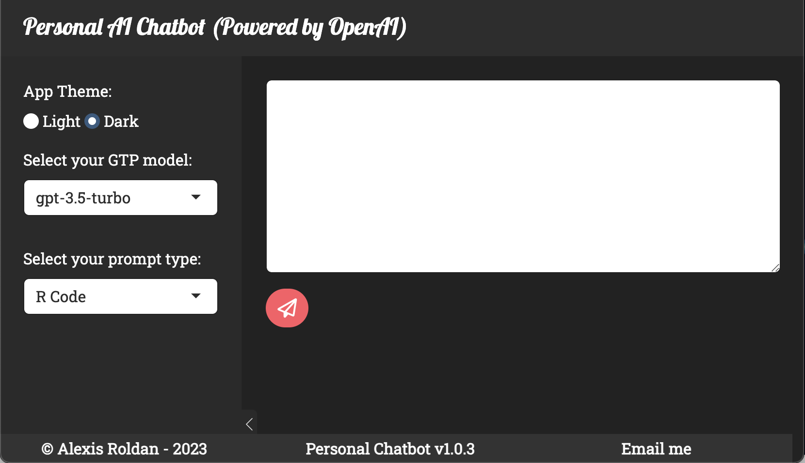
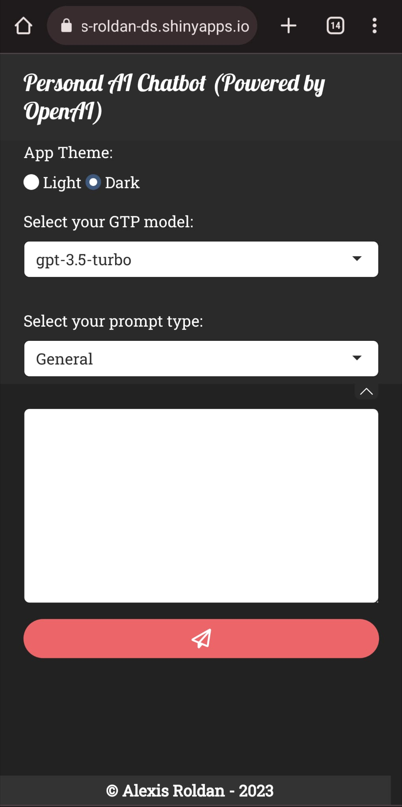

# Personal Ai Chatbot

**IMPORTANT:** Before cloning this repo and running the logic, please make sure to first register for an *OpenAI API Key*.

# Overview
Interactive chatbot app developed using R/Shiny and powered by OpenAI's gtp-3.5-turbo model. This personal chatbot can store prompt history to increase response efficiency.

## Preview - Full Window
<!--  -->


## Preview - Mobile Version
<!--  -->


## Configuration
Create a `.Renviron` file and store your OpenAI API key
```shell
api_key <- <Your API Key>
```
