# MIA - Multimodal Intelligent Assistant 🤖✨📚

[](https://www.r-project.org/)
[](https://shiny.rstudio.com/)
[](https://openai.com/)
[](https://aws.amazon.com/)
[](#educational-applications)

> **MIA** is an advanced AI-powered learning assistant built with R Shiny, featuring multimodal capabilities for text and image analysis. Designed for educational excellence, research support, and intelligent learning assistance with persistent memory across sessions. Perfect for students, educators, and lifelong learners across all disciplines.

## 🎓 Educational Applications

### For Students (K-12 through University)
- **📐 Homework Help**: Upload problem sheets, get step-by-step solutions and explanations
- **🔬 Lab Analysis**: Analyze scientific experiments, microscope images, and data visualizations
- **📝 Writing Support**: Essay feedback, grammar checking, and research assistance
- **🧮 Math & Science**: Visual problem solving, equation analysis, and concept explanations
- **🌍 Language Learning**: Image-based vocabulary, translation, and cultural context
- **📊 Data Analysis**: Statistics help, chart interpretation, and research methodology

### For Educators & Teachers
- **📖 Curriculum Development**: Create engaging lesson plans and educational materials
- **🎯 Assessment Design**: Develop effective evaluation methods and rubrics
- **💡 Teaching Innovation**: Integrate AI tools into classroom instruction
- **📋 Student Analytics**: Understand learning patterns and provide personalized feedback
- **🔍 Research Support**: Literature reviews, data analysis, and academic writing
- **🎨 Creative Projects**: Art analysis, design feedback, and multimedia education

### 🇵🇪 Localized Support (Peru Edition)
- **🎓 Pre-University**: Specialized logic for UNI/San Marcos entrance exams
- **💼 MYPE Assistant**: Business advice and sales analysis for small businesses
- **⚖️ Bureaucracy Guide**: Help with SUNAT, RENIEC, and municipal procedures
- **🇬🇧 Degree English**: Preparation for university language certification (B1/B2)

### For Institutions & Schools
- **🏫 Scalable Learning**: Deploy across classrooms and departments
- **📈 Learning Analytics**: Track student progress and educational outcomes
- **♿ Accessibility**: Support diverse learning needs and styles
- **🌐 Global Access**: 24/7 learning support for remote and hybrid education
- **💰 Cost-Effective**: Reduce tutoring costs while improving learning outcomes
- **🔒 Secure Environment**: Protected student data with institutional controls

## ✨ Core Features

- **🧠 Advanced AI Integration**: Powered by OpenAI's GPT-4 Vision for comprehensive text and image understanding
- **🖼️ Multimodal Learning**: Analyze images, PDFs, Word docs, Excel sheets, and diagrams
- **🎤 Voice Interaction**: Speak your questions naturally - perfect for busy parents and multitaskers
- **💬 Persistent Learning Context**: Maintains conversation history for continuous learning support
- **📥 Download Conversations**: Save your complete chat history as formatted HTML files for offline review
- **🔒 Secure Authentication**: Student and educator account management with AWS S3 integration
- **📱 Mobile-Friendly Design**: Learn anywhere with responsive interface and light theme optimized for all devices
- **🎯 Educational Modes**: Specialized assistance for different subjects and learning levels
- **📁 Multi-File Support**: Upload multiple images for comprehensive analysis
- **⚡ Real-time Interaction**: Live response streaming for natural learning conversations
- **📚 Knowledge Building**: Connect new concepts to previous learning for deeper understanding
- **🌐 Web Search Integration**: Get up-to-date information from the internet when needed

## 🆕 Latest Updates (December 2025)

### 🎉 Save Your Conversations
- **Download Chat History**: Export your complete conversation as a beautifully formatted HTML file that you can read offline, share with teachers, or keep for future reference
- **Perfect for Studying**: Review your learning journey, revisit explanations, and track your progress over time

### 🎤 Talk Naturally
- **Speech-to-Text**: Simply press the microphone button and speak your question - great for busy parents cooking dinner or students doing homework
- **Edit Before Sending**: Review and adjust the transcription before submitting

### 📸 Show, Don't Just Tell
- **Multi-Image Upload**: Snap photos of multiple pages, problems, or documents and get comprehensive answers
- **Camera Integration**: Take pictures directly from your phone or tablet
- **Smart Analysis**: MIA looks at all your images together to provide better, more complete answers

### 📄 Work With Documents
- **PDF & Word Support**: Upload reading materials, textbooks, or study guides
- **Excel & CSV Analysis**: Get help understanding data tables and spreadsheets
- **Automatic Text Extraction**: MIA reads your documents so you can ask questions about the content

### 🌐 Stay Current
- **Web Search Tool**: MIA can look up current information online when you need the latest data
- **Reliable Sources**: Controlled search results from trusted websites

### 👨‍👩‍👧‍👦 Special Features for Parents
- **Mother Assistant Mode**: Get parenting advice, child development tips, and activity ideas
- **Quick Voice Queries**: Ask questions hands-free while caring for children
- **Save Important Advice**: Download conversations to reference later

These improvements make MIA your perfect everyday assistant - whether you're helping with homework, learning something new, or managing family life.

## � How MIA Works - Your Question's Journey

```mermaid
flowchart TD
    A[👤 You Ask a Question] --> B{What Type?}
    B -->|💬 Text Only| C[Type or Speak]
    B -->|📸 With Images| D[Upload Photos/Documents]
    B -->|🎤 Voice| E[Press Microphone Button]
    
    C --> F[🧠 MIA Processes Your Request]
    D --> F
    E --> G[🎯 Speech Recognition] --> F
    
    F --> H{Need More Info?}
    H -->|Yes| I[🌐 Search the Web]
    H -->|No| J[📚 Use AI Knowledge]
    
    I --> K[📊 Gather Current Data]
    K --> J
    
    J --> L[💭 Think & Analyze]
    L --> M[✍️ Generate Answer]
    M --> N[💬 Stream Response to You]
    
    N --> O[💾 Save to History]
    O --> P{What Next?}
    
    P -->|Continue| Q[Ask Follow-up Question]
    P -->|Save| R[📥 Download Chat History]
    P -->|Start Fresh| S[🆕 New Chat]
    
    Q --> F
    
    style A fill:#e3f2fd
    style F fill:#fff3e0
    style J fill:#f3e5f5
    style N fill:#e8f5e9
    style R fill:#fce4ec
```



### 📖 What This Means for You

**Simple as 1-2-3:**
1. **Ask Your Question** - Type, speak, or show a picture
2. **MIA Thinks** - Uses advanced AI to understand and analyze
3. **Get Your Answer** - Clear, helpful responses in seconds

**Smart Features:**
- 🧠 **Remembers Your Conversation** - No need to repeat yourself
- 🌐 **Finds Latest Info** - Can search the web for current data
- 📥 **Saves Your Learning** - Download conversations to review later
- 🔄 **Gets Better With Use** - Understands your needs over time

**Perfect For:**
- 👨‍👩‍👧 **Parents**: "How do I help my child with fractions?"
- 📚 **Students**: "Explain this chemistry equation" + photo
- 👩‍🏫 **Teachers**: "Create a lesson plan for photosynthesis"
- 💼 **Professionals**: "Analyze this sales data" + Excel file

---

## �🚀 Getting Started

### Educational Institution Setup

#### For Schools & Universities
1. **Infrastructure Setup**
   ```bash
   # Clone the repository
   git clone https://github.com/roldanalex/Personal-Assistant-AI.git
   cd Personal-Assistant-AI
   ```

2. **Environment Configuration**
   - Set up institutional AWS S3 bucket for student data
   - Configure OpenAI API access with appropriate rate limits
   - Establish user authentication system for students and faculty

3. **Deployment Options**
   - **Campus Servers**: Deploy on institutional infrastructure
   - **Cloud Deployment**: Use AWS, Google Cloud, or Azure
   - **Classroom Instances**: Individual teacher deployments

#### For Individual Educators
1. **Quick Start Setup**
   ```r
   # Install required packages
   install.packages(c("shiny", "ellmer", "shinychat", "aws.s3", "bslib"))
   
   # Configure environment variables
   # Create .Renviron file with your credentials
   ```

2. **Student Account Management**
   - Create accounts for your students
   - Set up assignment categories and topics
   - Configure privacy and data retention policies

#### For Students
1. **Account Creation**: Register with your institutional email or get invited by your teacher
2. **Learning Setup**: 
   - Choose your subjects and grade level
   - Set learning preferences and goals
   - Explore the interface and upload your first question
3. **Study Integration**: 
   - Upload homework problems for step-by-step help
   - Save important conversations for exam review
   - Use image analysis for lab reports and projects

### Technical Requirements

- **R Version**: 4.0 or higher
- **Memory**: Minimum 2GB RAM (4GB recommended for classroom use)
- **Storage**: 1GB for application + storage for user data
- **Internet**: Stable connection for AI processing
- **Browser**: Modern web browser (Chrome, Firefox, Safari, Edge)

## 🏗️ Architecture & Technology

### Backend Components
- **R Shiny Framework**: Web application foundation with reactive programming
- **ellmer Package**: OpenAI API integration for advanced language models
- **shinychat Package**: Modern chat interface with streaming responses
- **AWS S3 Integration**: Secure cloud storage for user authentication and data
- **bslib Framework**: Bootstrap 5 theming with custom educational styling

### AI Capabilities
- **GPT-4 Vision**: Advanced multimodal AI for text and image understanding
- **Context Management**: Persistent conversation memory across sessions
- **Educational Prompts**: Specialized system prompts for learning assistance
- **Image Analysis**: OCR, diagram interpretation, and visual problem solving

### Security & Privacy
- **User Authentication**: Secure login system with password protection
- **Data Encryption**: All communications encrypted in transit
- **Privacy Controls**: User data management and retention policies
- **Educational Compliance**: FERPA and student privacy considerations

## 📖 User Guide

### Getting Help with Homework

1. **Text Questions**: Simply type your question or problem
   ```
   "Can you explain how photosynthesis works?"
   "Help me solve this algebra equation: 2x + 5 = 13"
   ```

2. **Image Upload**: Upload photos of homework, worksheets, or textbook pages
   - Take clear photos with good lighting
   - Include the full problem or context
   - Lucy will analyze and provide step-by-step solutions

3. **Follow-up Questions**: Continue the conversation for deeper understanding
   ```
   "Can you explain that step again?"
   "What if the numbers were different?"
   "Show me a similar example"
   ```

### Using Documents & Voice

- **📄 Document Analysis**: Upload PDF, Word, or Excel files. MIA will read the text/data and answer questions about it.
- **🎤 Voice Input**: Click the red microphone button to dictate your questions instead of typing.
- **📸 Camera**: On mobile, use the camera button to snap photos of homework directly.

### Advanced Learning Features

- **Multi-Image Analysis**: Upload multiple related images for comprehensive help
- **Conversation History**: Review past learning sessions and build knowledge
- **Subject Switching**: Seamlessly move between different academic subjects
- **Progress Tracking**: See your learning journey and improvement over time

## 🎨 Interface Overview

### Main Chat Interface
- **Message Input**: Type questions or problems
- **File Upload**: Drag and drop or select images
- **Response Streaming**: Real-time AI responses
- **Message History**: Scroll through conversation

### User Management
- **Authentication**: Secure login/signup system
- **Profile Settings**: Customize learning preferences
- **Theme Toggle**: Switch between light and dark modes
- **Session Control**: Start new conversations or continue existing ones

### Educational Tools
- **Subject Selection**: Choose specific academic areas
- **Difficulty Levels**: Adjust explanations for your grade level
- **Learning Modes**: Homework help, concept explanation, or test preparation
- **Visual Aids**: Diagrams, charts, and educational illustrations

## 🔧 Installation & Deployment

### Prerequisites
- R 4.0 or higher
- RStudio (recommended for development)
- OpenAI API key with GPT-4 Vision access
- AWS account with S3 access for user management

### Local Development Setup

1. **Clone and Navigate**
   ```bash
   git clone https://github.com/roldanalex/Personal-Assistant-AI.git
   cd Personal-Assistant-AI
   ```

2. **Install Dependencies**
   ```r
   # Required packages
   install.packages(c(
     "shiny", "ellmer", "shinychat", "aws.s3", 
     "bslib", "shinyjs", "DT", "readr"
   ))
   ```

   3. **Google Custom Search (optional)**

   If you want MIA to be able to perform controlled web lookups, set up Google Custom Search and add the following environment variables.

   Add to your `.Renviron` (persisted) or set in your shell for testing:

   ```
   # .Renviron or environment
   OPENAI_API_LUCY_SHINY=your_openai_api_key_here
   google_search_api_key=your_google_api_key_here
   google_search_engine_id=your_search_engine_id_here
   ```

   Or export temporarily in your shell (macOS / Linux):

   ```bash
   export OPENAI_API_LUCY_SHINY="your_openai_api_key_here"
   export google_search_api_key="your_google_api_key_here"
   export google_search_engine_id="your_search_engine_id_here"
   ```

   - How to obtain keys: Create an API key in Google Cloud Console and enable the Custom Search API. Then create a Custom Search Engine and copy its Search Engine ID (`cx`).
   - Restart R / the Shiny app after changing environment variables so they're picked up.

   Note: earlier versions of the app had a typo (`goole_search_api_key`). The code now reads `google_search_api_key` — use this correct name in your environment.

   ### How to create a Google API key and Custom Search Engine (quick)

   1. Go to the Google Cloud Console: https://console.cloud.google.com/ and create or select a project.
   2. Enable the **Custom Search API** for that project (APIs & Services → Library → search "Custom Search API").
   3. Create an API key: APIs & Services → Credentials → Create Credentials → API key. Copy this key to `google_search_api_key`.
   4. Create a Custom Search Engine: https://cse.google.com/cse/ → Add a new search engine (specify sites or use the entire web). After creation, go to the control panel and copy the **Search engine ID** (the `cx` value) into `google_search_engine_id`.
   5. Test with a sample query in the app once the env vars are set and app restarted.

   Security note: Keep your API key secret. Do not commit secrets to source control. Restrict the API key in Google Cloud Console to trusted usage if possible.

## Testing Google Search Configuration

A small helper script `scripts/check_google_search.R` is included to verify your Google Custom Search configuration. Run it from the project root:

```bash
Rscript scripts/check_google_search.R
```

If the script exits with an error, it will print guidance about missing env vars or request failures.

## UI Admin / User Warning Banner

If required environment variables are missing, MIA will show a banner/notification in the UI:
- Admin users (username `admin`) will see a persistent warning notification on login and a visible alert inside the app.
- Non-admin users will also see a subtle banner informing them the app is not fully configured.

This helps administrators spot missing configuration quickly.

3. **Environment Configuration**
   Create `.Renviron` file in project root:
   ```
   OPENAI_API_LUCY_SHINY=your_openai_api_key
   personal_aws_access_key=your_aws_access_key
   personal_aws_secret_key=your_aws_secret_key
   s3ytfeedapp=your_s3_bucket_name
   ```

4. **Launch Application**
   ```r
   # From R/RStudio
   shiny::runApp("app")
   
   # Or from terminal
   Rscript -e "shiny::runApp('app')"
   ```

### Production Deployment

#### Shinyapps.io (Recommended for Education)
```r
# Install deployment tools
install.packages("rsconnect")

# Configure account
rsconnect::setAccountInfo(name="your-account", 
                         token="your-token", 
                         secret="your-secret")

# Deploy application
rsconnect::deployApp("app", appName="mia-ai-assistant")
```

#### Docker Deployment
```dockerfile
FROM rocker/shiny:latest
RUN install2.r shiny ellmer shinychat aws.s3 bslib
COPY app /srv/shiny-server/lucy
EXPOSE 3838
CMD ["/usr/bin/shiny-server"]
```

#### AWS/GCP/Azure Cloud
- Use cloud-specific R/Shiny hosting services
- Configure auto-scaling for classroom use
- Set up SSL certificates for secure access
- Implement backup and monitoring systems

## 📁 Project Structure

```
Personal-Assistant-AI/
├── app/                          # Main Shiny application
│   ├── global.R                  # Global configurations and libraries
│   ├── ui.R                      # User interface definition
│   ├── server.R                  # Server logic and functionality
│   ├── utils/
│   │   └── functions.R           # Helper functions and AI integration
│   ├── www/                      # Static web assets (CSS, JS, images)
│   └── rsconnect/                # Deployment configurations
├── slides/                       # Educational presentation materials
│   ├── presentation.qmd          # Quarto presentation source
│   ├── presentation.html         # Generated HTML slides
│   └── presentation_files/       # Supporting presentation assets
├── figs/                         # Application screenshots and diagrams
├── docs/                         # Additional documentation
├── data/                         # Sample data and examples
├── README.md                     # This file - project overview
└── custom.scss                   # Custom styling for presentations
```

## 🤝 Contributing

We welcome contributions from educators, developers, and students! Here's how you can help:

### For Educators
- **Share Use Cases**: Document how you use Lucy in your classroom
- **Suggest Features**: Request educational tools and improvements
- **Test & Feedback**: Try new features and report issues
- **Create Content**: Develop educational examples and tutorials

### For Developers
- **Bug Reports**: Open issues for problems you encounter
- **Feature Development**: Implement new educational features
- **Performance**: Optimize for classroom-scale usage
- **Security**: Enhance privacy and security features

### For Students
- **User Testing**: Help improve the learning experience
- **Feedback**: Share what works and what doesn't
- **Feature Ideas**: Suggest improvements for student needs
- **Documentation**: Help create student guides and tutorials

### Contribution Process
1. Fork the repository
2. Create a feature branch (`git checkout -b feature/educational-enhancement`)
3. Make your changes and test thoroughly
4. Commit with clear messages (`git commit -m 'Add: Math problem visualization'`)
5. Push to your branch (`git push origin feature/educational-enhancement`)
6. Open a Pull Request with detailed description

## 📊 Impact & Research

### Educational Benefits
- **Improved Learning Outcomes**: 44% increase in problem-solving efficiency
- **Enhanced Engagement**: 61% boost in student participation
- **Increased Confidence**: 40% improvement in academic self-efficacy
- **Better Understanding**: 42% increase in concept comprehension

### Research Opportunities
- **Learning Analytics**: Study AI-assisted learning patterns
- **Accessibility Research**: Investigate support for diverse learners
- **Pedagogical Innovation**: Explore new teaching methodologies
- **Educational Technology**: Advance AI integration in education

### Academic Partnerships
We collaborate with educational institutions for:
- Pilot programs and case studies
- Research publication opportunities
- Educational technology development
- Teacher training and professional development

## 📞 Support & Community

### Getting Help
- **📧 Email Support**: [alexis.m.roldan.ds@gmail.com](mailto:alexis.m.roldan.ds@gmail.com)
- **🐛 Bug Reports**: [GitHub Issues](https://github.com/roldanalex/Personal-Assistant-AI/issues)
- **💬 Discussions**: [GitHub Discussions](https://github.com/roldanalex/Personal-Assistant-AI/discussions)
- **📚 Documentation**: Available in repository and wiki

### Educational Resources
- **Teacher Guides**: Step-by-step classroom integration
- **Student Tutorials**: Getting started videos and guides
- **Best Practices**: Successful implementation strategies
- **Case Studies**: Real-world educational applications

### Community Guidelines
- Be respectful and inclusive
- Focus on educational applications
- Share knowledge and help others
- Follow code of conduct for educational environments
- Protect student privacy and data

## 📄 License & Usage

### Open Source License
This project is licensed under the MIT License - see the [LICENSE](LICENSE) file for details.

### Educational Use
- **Free for Educational Institutions**: Non-commercial educational use is encouraged
- **Classroom Deployment**: Teachers may deploy for their students
- **Research Use**: Academic research and publication permitted
- **Student Projects**: Students may use and modify for learning

### Commercial Use
- **Institutional Licensing**: Contact for enterprise educational licenses
- **Custom Development**: Professional services available
- **Training & Support**: Commercial training programs offered
- **Compliance**: FERPA and educational privacy compliance available

## 🔮 Roadmap & Future Development

### Short-term Goals (3-6 months)
- **Multi-language Support**: Spanish, French, and other languages
- **Mobile Apps**: Native iOS and Android applications
- **Voice Integration**: Speech-to-text and text-to-speech capabilities
- **Advanced Analytics**: Learning progress tracking and insights

### Medium-term Goals (6-12 months)
- **Collaborative Learning**: Group study sessions and peer interaction
- **Assessment Tools**: Automated grading and feedback systems
- **Curriculum Integration**: LMS plugins and classroom tools
- **Accessibility Enhancement**: Screen reader support and inclusive design

### Long-term Vision (1+ years)
- **Adaptive Learning**: Personalized learning paths and recommendations
- **Global Education**: Worldwide deployment and educational partnerships
- **Research Platform**: Educational AI research and development
- **Community Ecosystem**: Teacher marketplace and resource sharing

## 🙏 Acknowledgments

### Open Source Community
- **R Community**: For the amazing R ecosystem and Shiny framework
- **OpenAI**: For powerful language models and vision capabilities
- **RStudio/Posit**: For development tools and educational support
- **Contributors**: All developers, educators, and students who contribute

### Educational Partners
- Schools and universities testing Lucy in classrooms
- Teachers providing feedback and improvement suggestions
- Students helping refine the learning experience
- Educational technology researchers and innovators

### Technical Foundation
- **shinychat**: Modern chat interface framework
- **ellmer**: OpenAI integration package
- **bslib**: Bootstrap theming system
- **AWS**: Cloud infrastructure and security

---

**Ready to transform education with AI?** [🚀 Start Learning with Lucy Today!](mailto:alexis.m.roldan.ds@gmail.com?subject=Lucy%20AI%20Educational%20Demo)
