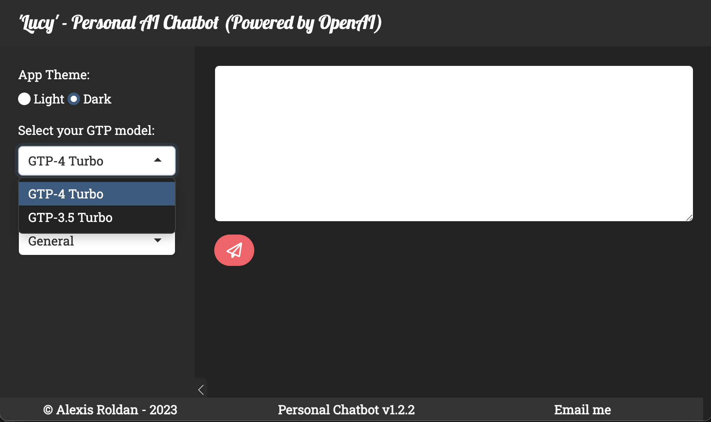

# Lucy - Personal AI Assistant

[](https://www.r-project.org/)
[](https://shiny.rstudio.com/)
[](https://openai.com/)

A sophisticated, interactive AI assistant built with R Shiny and powered by OpenAI's advanced language models. Lucy provides intelligent conversational AI capabilities with specialized modes for different programming contexts and maintains conversation history for enhanced user experience.

## 🚀 Features

### Core Capabilities
- **Multi-Modal AI Assistance**: Supports general conversation, R programming, Python development, and SQL database queries
- **Conversation Memory**: Maintains chat history throughout sessions for contextual continuity
- **Model Selection**: Choose between GPT-4.1 and GPT-3.5 Turbo based on your needs
- **Responsive Design**: Fully responsive interface optimized for both desktop and mobile devices
- **Theme Customization**: Light and dark theme options for comfortable usage

### Specialized Modes
- **General Assistant**: General-purpose conversational AI for everyday queries
- **R Code Assistant**: Specialized support for R programming, debugging, and best practices
- **Python Code Assistant**: Expert guidance for Python development and troubleshooting  
- **SQL Assistant**: Database query optimization and SQL development support

### Technical Features
- Real-time API integration with OpenAI
- Session-based conversation persistence
- Error handling and retry mechanisms
- Rate limiting for API efficiency
- Modern Bootstrap-based UI with custom styling

## 📱 Application Preview

### Desktop Interface


### Mobile Interface


## 🛠️ Installation & Setup

### Prerequisites
- R (version 4.0 or higher)
- RStudio (recommended)
- OpenAI API Key

### Required R Packages
```r
install.packages(c(
  "shiny",
  "shinyWidgets", 
  "bslib",
  "httr2",
  "purrr",
  "glue",
  "shinyBS"
))
```

### Configuration

1. **Obtain OpenAI API Key**
   - Sign up at [OpenAI](https://platform.openai.com/)
   - Generate an API key from your dashboard

2. **Environment Setup**
   Create a `.Renviron` file in your project root:
   ```
   OPENAI_API_LUCY_SHINY=your_api_key_here
   ```

3. **Launch Application**
   ```r
   # Navigate to the app directory
   setwd("path/to/Personal-Assistant-AI/app")
   
   # Run the application
   shiny::runApp()
   ```

## 🏗️ Project Structure

```
Personal-Assistant-AI/
├── app/
│   ├── global.R          # Global configurations and library imports
│   ├── ui.R              # User interface definition
│   ├── server.R          # Server-side logic
│   ├── utils/
│   │   └── functions.R   # Core AI interaction functions
│   └── www/              # Static web assets
├── data/                 # Data storage directory
├── docs/                 # Documentation
├── figs/                 # Application screenshots
└── README.md
```

## 🔧 Usage

1. **Select Your Model**: Choose between GPT-4.1 for advanced reasoning or GPT-3.5 Turbo for faster responses
2. **Choose Assistant Mode**: Select the appropriate mode based on your query type
3. **Start Conversing**: Type your message and click send
4. **Review History**: Previous conversations remain visible for context

### Best Practices
- Use specific, clear prompts for better responses
- Select the appropriate assistant mode for optimal results
- Take advantage of conversation history for follow-up questions

## 🤝 Contributing

Contributions are welcome! Please feel free to submit a Pull Request. For major changes, please open an issue first to discuss what you would like to change.

## 📄 License

This project is licensed under the MIT License - see the [LICENSE](LICENSE) file for details.

## 👨‍💻 Author

**Alexis Roldan**
- Email: alexis.m.roldan.ds@gmail.com
- GitHub: [@roldanalex](https://github.com/roldanalex)

## 🙏 Acknowledgments

- OpenAI for providing the powerful language models
- RStudio team for the excellent Shiny framework
- R community for the robust ecosystem of packages

---

*Lucy v1.2.2 - Your intelligent programming companion*
